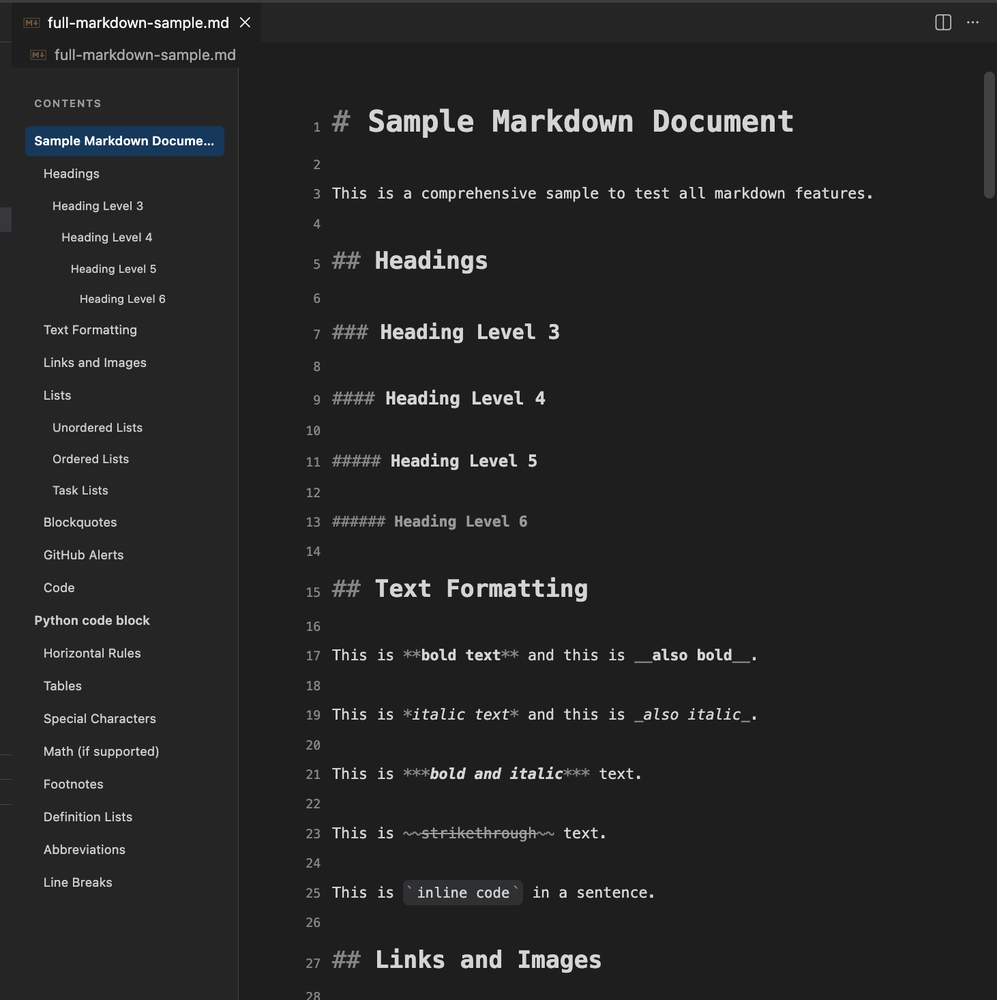
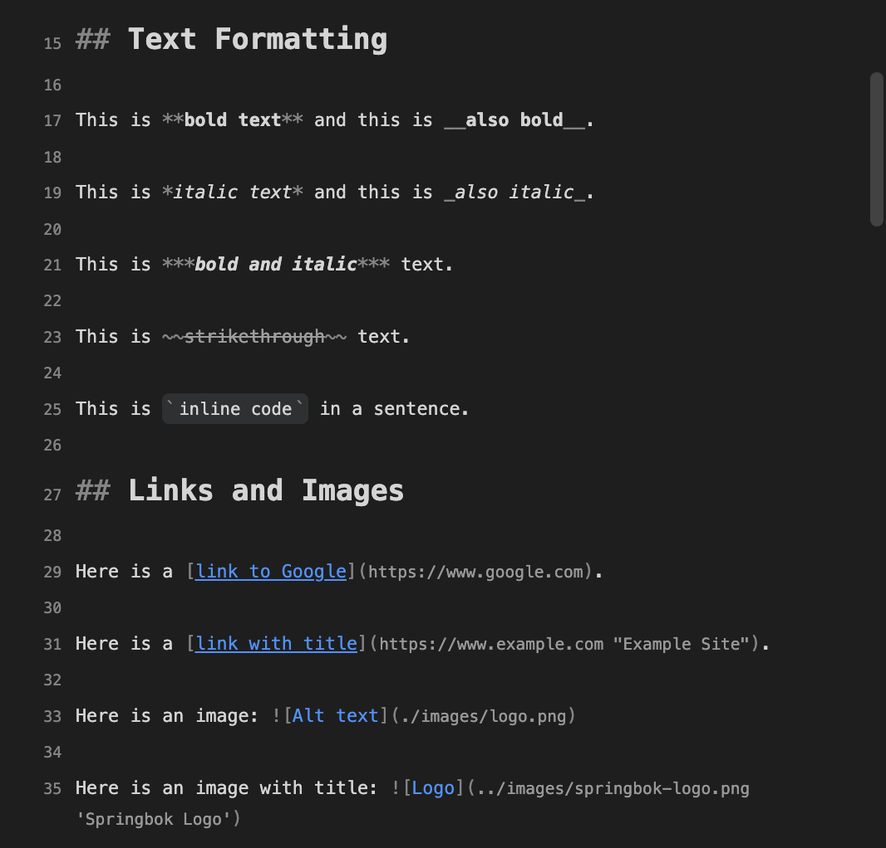
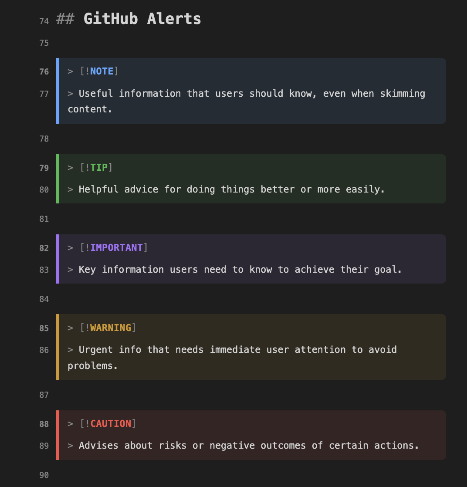
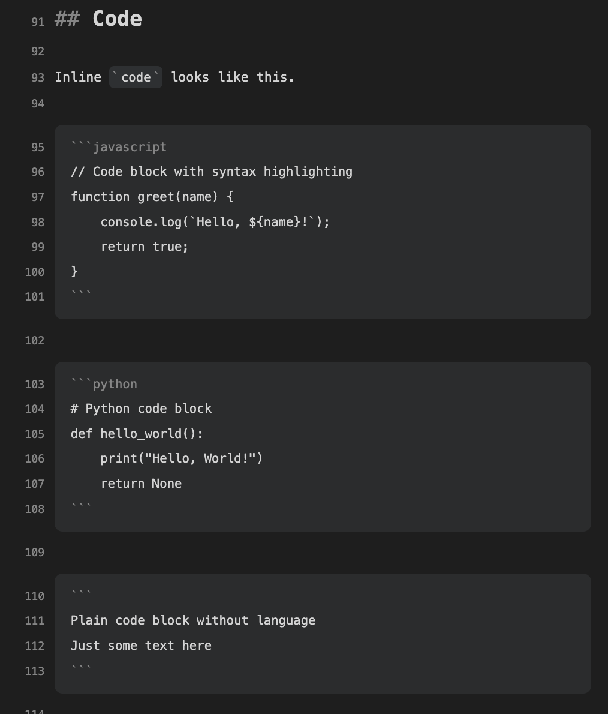

# Markdown WYSIWYG

A beautiful WYSIWYG-style markdown editor for VS Code that renders markdown syntax with visual styling while keeping the raw markdown fully editable.



## Features

### 📝 Visual Markdown Editing
- **Styled Headings**: H1-H6 rendered with proper typography and sizing
- **Text Formatting**: Bold, italic, strikethrough, and inline code with visual styling
- **Links & Images**: Clickable links (Cmd/Ctrl+Click) with styled syntax
- **Code Blocks**: Syntax-highlighted fenced code blocks with rounded corners
- **Blockquotes**: Styled blockquotes with left border and background
- **Lists**: Unordered, ordered, and task lists with proper indentation
- **Tables**: Clean table rendering with separator styling
- **Horizontal Rules**: Visual dividers with centered syntax

### 🎨 GitHub-Style Alerts
Full support for GitHub's alert syntax:
- `[!NOTE]` - Blue informational notes
- `[!TIP]` - Green helpful tips  
- `[!IMPORTANT]` - Purple important information
- `[!WARNING]` - Yellow/orange warnings
- `[!CAUTION]` - Red caution alerts

### 📑 Table of Contents
- Auto-generated sidebar TOC from document headings
- Click to navigate to any section
- Scroll spy highlights current section
- Collapsible for more editing space

### 🎯 Editor Features
- **Line Numbers**: Always visible line numbers for easy reference
- **Syntax Visible**: Markdown syntax stays visible and editable
- **VS Code Theme Integration**: Respects your VS Code color theme
- **Bidirectional Sync**: Changes sync with the actual file
- **Undo/Redo**: Full undo/redo support via VS Code
- **Local Images**: Supports relative image paths

## Installation

### From VS Code Marketplace
1. Open VS Code
2. Go to Extensions (Cmd/Ctrl+Shift+X)
3. Search for "Markdown WYSIWYG"
4. Click Install

### From VSIX
1. Download the `.vsix` file from releases
2. In VS Code: Cmd/Ctrl+Shift+P → "Extensions: Install from VSIX..."
3. Select the downloaded file

## Usage

### Opening Files
- **Right-click** any `.md` file → **Open With...** → **Markdown WYSIWYG**
- Or set as default: **Open With...** → Select editor → **Configure Default Editor...**

### Keyboard Shortcuts
| Shortcut | Action |
|----------|--------|
| `Cmd/Ctrl+Click` | Open link in browser |
| `Tab` | Insert 4 spaces |
| `Enter` | New line |
| `Backspace` | Delete/merge lines |
| `Cmd/Ctrl+Z` | Undo |
| `Cmd/Ctrl+Shift+Z` | Redo |

### Supported Markdown Syntax

```markdown
# Heading 1
## Heading 2

**bold** or __bold__
*italic* or _italic_
***bold and italic***
~~strikethrough~~
`inline code`

[Link](https://example.com)


- Unordered list
1. Ordered list
- [ ] Task list
- [x] Completed task

> Blockquote
>> Nested blockquote

> [!NOTE]
> GitHub-style alert

\`\`\`javascript
// Code block
\`\`\`

| Table | Header |
|-------|--------|
| Cell  | Cell   |

---
Horizontal rule
```

## Screenshots

### Headings and Text Formatting


### GitHub Alerts


### Code Blocks


## Development

### Prerequisites
- Node.js 18+
- Yarn

### Setup
```bash
git clone https://github.com/yourusername/vscode-extension-markdown-beautiful-editor.git
cd vscode-extension-markdown-beautiful-editor
yarn install
```

### Build
```bash
yarn run compile      # Build extension
yarn run watch        # Watch mode for development
```

### Test
```bash
yarn run test:unit    # Run unit tests
yarn run test         # Run all tests
```

### Debug
1. Open project in VS Code
2. Press F5 to launch Extension Development Host
3. Open any `.md` file with the WYSIWYG editor

### Project Structure
```
src/
├── extension.ts              # Extension entry point
├── editor/
│   ├── customEditorProvider.ts  # VS Code custom editor
│   └── webviewContent.ts        # Webview HTML generation
├── webview/
│   ├── main.ts               # Webview editor logic
│   └── toc.ts                # Table of contents
├── styles/
│   └── editor.css            # Editor styling
└── test/
    ├── unit/                 # Unit tests
    └── integration/          # Integration tests
```

## Contributing

Contributions are welcome! Please:
1. Fork the repository
2. Create a feature branch
3. Make your changes
4. Run tests: `yarn test`
5. Submit a pull request

## License

MIT License - see [LICENSE](LICENSE) for details.

## Changelog

See [CHANGELOG.md](CHANGELOG.md) for version history.

---

**Enjoy writing markdown!** ✨
