# Markdown Beautiful Editor

A beautiful WYSIWYG-style markdown editor for VS Code that renders markdown syntax with visual styling while keeping the raw markdown fully editable.

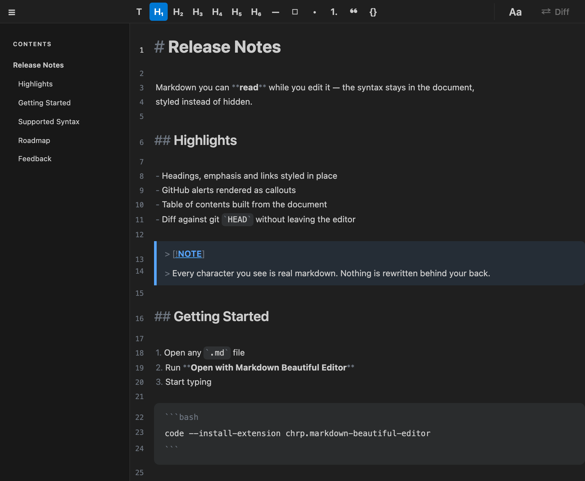

## Features

### 📝 Visual Markdown Editing
- **Styled Headings**: H1-H6 rendered with proper typography and sizing
- **Text Formatting**: Bold, italic, strikethrough, and inline code with visual styling
- **Links & Images**: Clickable links (Cmd/Ctrl+Click) with styled syntax
- **Code Blocks**: Syntax-highlighted fenced code blocks with rounded corners
- **Blockquotes**: Styled blockquotes with left border and background (supports nested quotes)
- **Lists**: Unordered, ordered, and task lists with proper indentation
- **Tables**: Clean table rendering with separator styling
- **Horizontal Rules**: Visual dividers with centered syntax

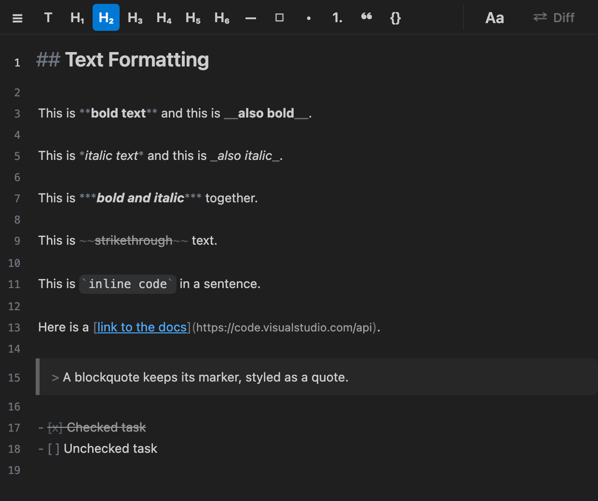

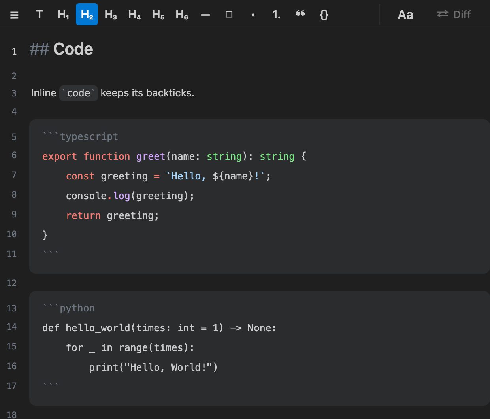

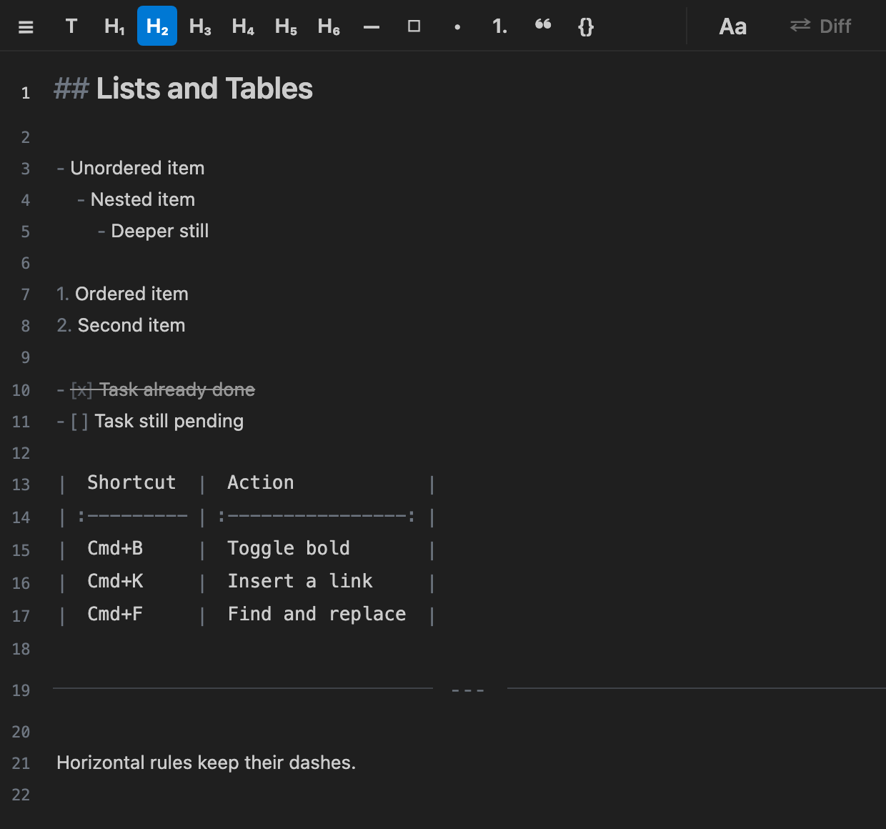

### 🏷️ YAML Frontmatter
A `---` block on the first line of the file renders as a metadata panel:
- Parsed as YAML — not as a horizontal rule followed by a giant heading
- Syntax-highlighted keys, strings and comments, including nested maps and lists
- The markdown below the closing `---` is unaffected

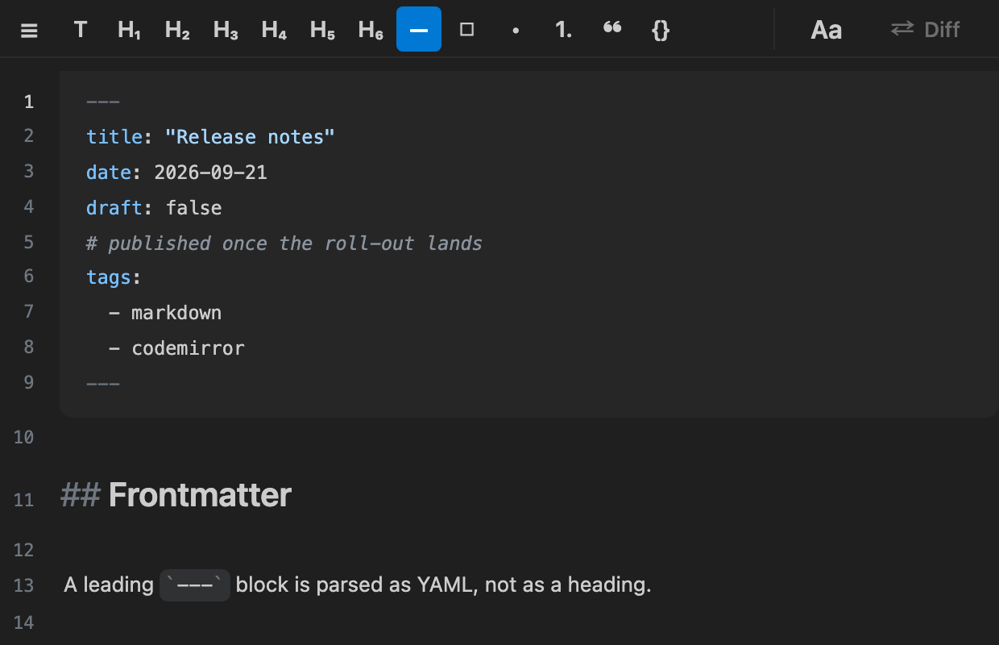

### 🎨 GitHub-Style Alerts
Full support for GitHub's alert syntax:
- `[!NOTE]` - Blue informational notes
- `[!TIP]` - Green helpful tips  
- `[!IMPORTANT]` - Purple important information
- `[!WARNING]` - Yellow/orange warnings
- `[!CAUTION]` - Red caution alerts

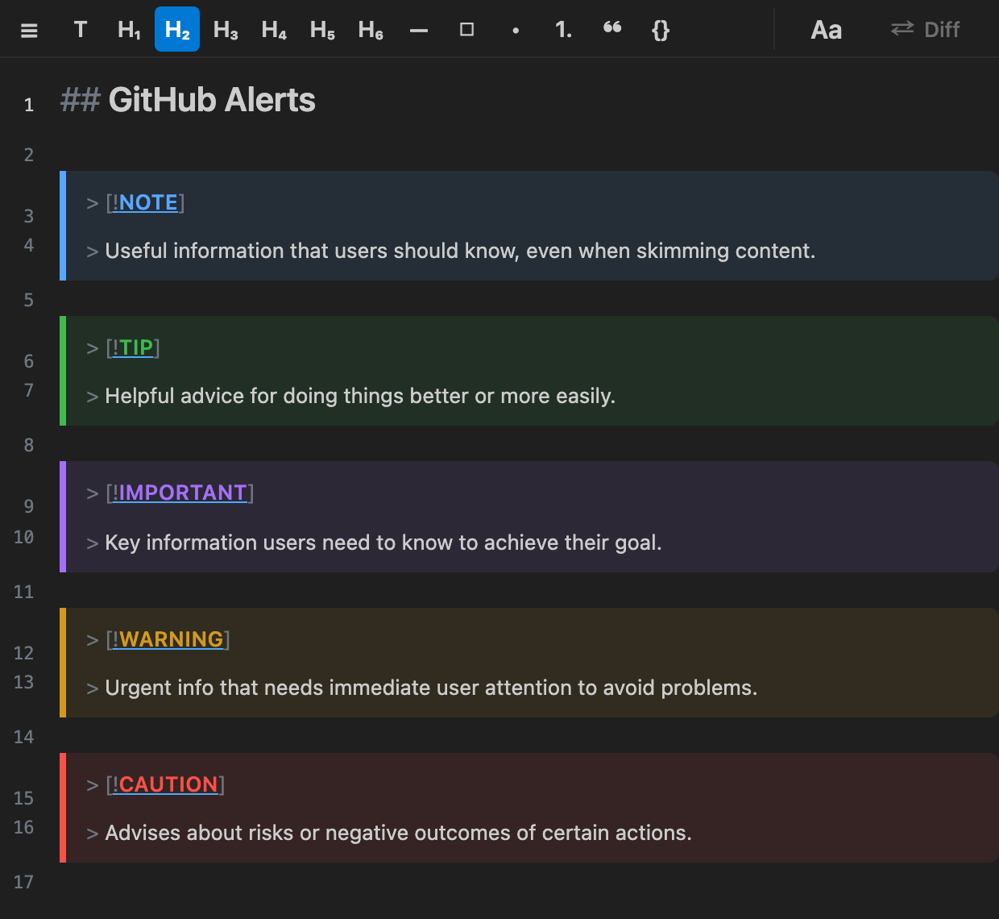

### 📑 Table of Contents
- Auto-generated sidebar TOC from document headings
- Click to navigate to any section
- Scroll spy highlights current section
- Toggle it from the toolbar (☰) for more editing space; hidden by default on narrow viewports

### 🛠️ Formatting Toolbar
- **Selection-based toolbar**: Appears when you select text
- **Toggle formatting**: Bold, italic, code, strikethrough, and links
- **Smart detection**: Toolbar highlights active formatting at cursor position
- **Keyboard shortcuts**: Cmd/Ctrl+B (bold), Cmd/Ctrl+I (italic), Cmd/Ctrl+E (code), Cmd/Ctrl+K (link)

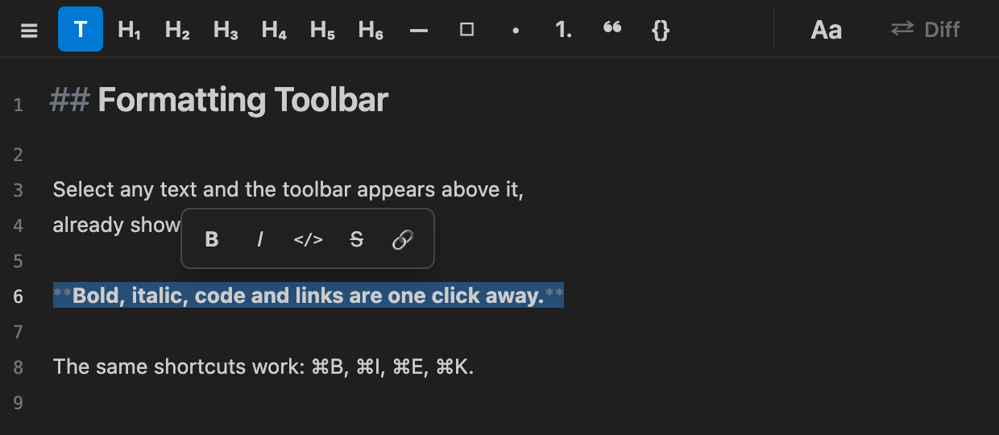

### 🔍 Find & Replace
- **Cmd/Ctrl+F**: Opens a find panel over the document, including the parts scrolled out of view
- **Match options**: Case sensitivity, whole word, and regular expressions
- **Replace**: Available whenever the document is editable; a read-only side of a diff shows find only
- **Occurrences**: Cmd/Ctrl+D selects the next occurrence of the selection

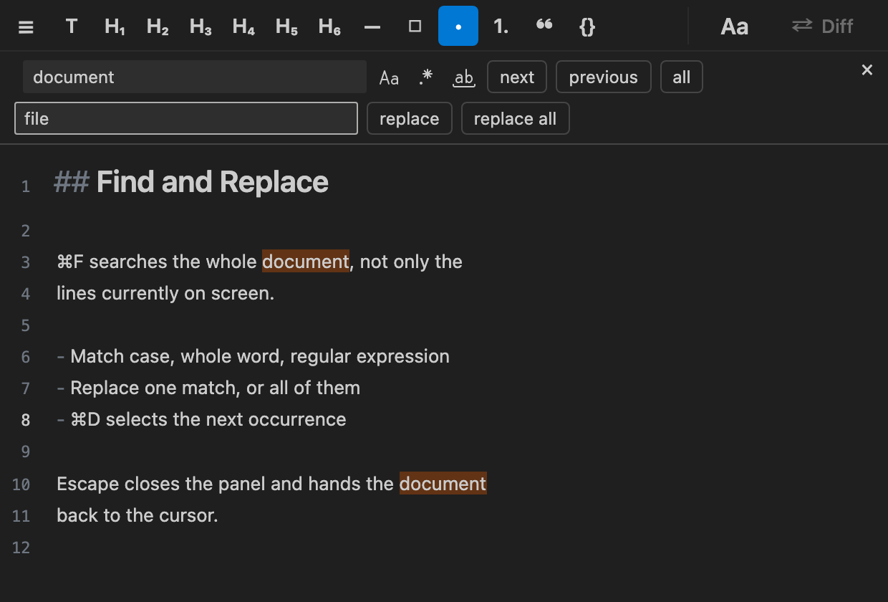

### ↕️ Multiple Cursors
- **Alt/Option+Click**: Adds a cursor where you click
- **Alt/Option+Drag**: Selects a rectangle — one cursor per line
- **Cmd/Ctrl+Alt+Up/Down**: Adds a cursor on the line above or below
- **Escape**: Collapses back to a single cursor
- **Formatting follows**: Bold/italic/code/link and the line type selector apply at every cursor

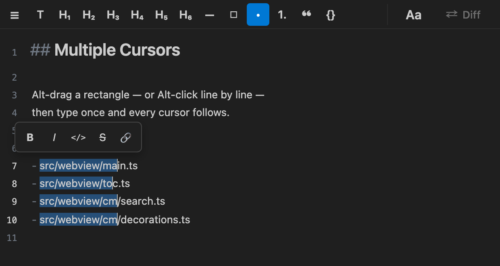

### 📋 Line Type Selector
- **Quick line conversion**: Click the line type icon next to any line number
- **Supported types**: Text, Headings (H1-H6), Bullet List, Numbered List, Task List, Quote, Code Block, Horizontal Rule
- **Visual indicators**: Each line shows its type with a distinctive icon
- **Nested support**: Properly handles nested blockquotes

### 🔤 Content Font
- **Proportional by default**: Prose renders with the UI font
- **Monospace option**: `markdown.beautifulEditor.fontFamily` set to `mono` uses the editor font
- **Temporary toggle**: The `Aa` button on the right of the toolbar switches the font for the current panel only, without changing the setting
- **Code stays monospace**: Inline code, fenced code blocks and tables always use the editor font

### 🔀 Diffs
- **From an open diff**: The ✨ button in a text diff's title bar switches that comparison into the Beautiful Diff view, on exactly the versions that diff was showing
- **From Source Control**: Right-click a `.md` row in the Source Control panel (under **Changes**, **Staged Changes** or **Untracked**) → **Open Beautiful Markdown Diff**, in the same section as *Open File* and *Open Changes*
- **Correct pairing**: **Changes** compares the index against your working tree, **Staged Changes** compares HEAD against the index, and staged adds, deletes and renames each get the pair VS Code itself would show
- **Labelled**: The tab reads `NOTES.md (Staged)` or `(Unstaged)`, and the panel header shows that scope alongside the exact refs — so two diffs of the same file are never confusable
- **Editable where it can be**: In an **Unstaged** or **Untracked** view the right pane is the file on disk — type in it, or use the `→` button beside a changed block to revert it. A **Staged** view is read-only: that side is the git index, which can't be written directly
- **Staging stays in git**: Stage, unstage and discard from the Source Control panel as usual

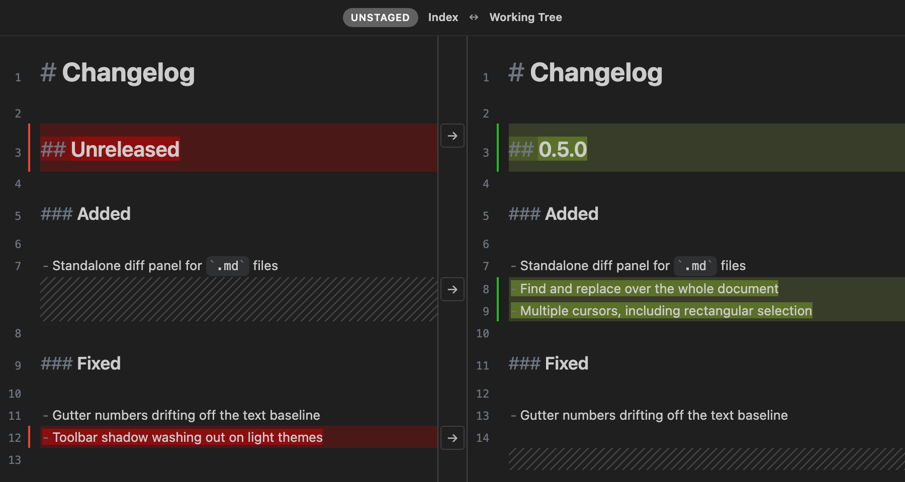

### ⇄ Diff Mode (in the editor)

- **Toggle**: The ⇄ button in the editor toolbar — or the compare button in the tab's title bar — compares the open file against git HEAD, side by side, with markdown styling on both sides
- **Editable**: The right-hand pane is the live document — type in it and the file is updated, same as editing normally
- **Revert a chunk**: Each changed block gets a `→` button in the narrow column between the two panes — click it to restore that block from HEAD

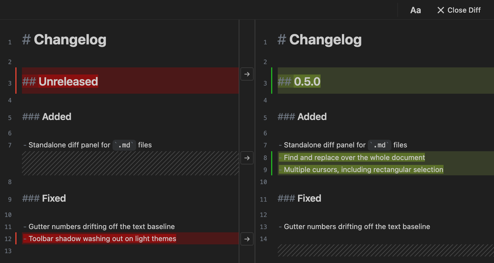

### 🎯 Editor Features
- **Line Numbers**: Always visible line numbers for easy reference
- **Syntax Visible**: Markdown syntax stays visible and editable
- **VS Code Theme Integration**: Respects your VS Code color theme
- **Bidirectional Sync**: Changes sync with the actual file
- **Undo/Redo**: Full undo/redo support via VS Code
- **Local Images**: Supports relative image paths
- **Clipboard Support**: Full copy, cut, paste, and select all (Cmd/Ctrl+A)
- **Cursor Persistence**: Cursor position preserved when switching tabs

## Installation

### From VS Code Marketplace
1. Open VS Code
2. Go to Extensions (Cmd/Ctrl+Shift+X)
3. Search for "Markdown Beautiful Editor"
4. Click Install

### From VSIX
1. Download the `.vsix` file from releases
2. In VS Code: Cmd/Ctrl+Shift+P → "Extensions: Install from VSIX..."
3. Select the downloaded file

## Usage

### Opening Files
- **Right-click** any `.md` file → **Open With...** → **Markdown Beautiful Editor**
- Or set as default: **Open With...** → Select editor → **Configure Default Editor...**

### Diffs

Two ways in:

- The **✨ button** in an open text diff's title bar.
- **Right-click a file row in the Source Control panel** → **Open Beautiful Markdown Diff**
  (top section, with *Open File* and *Open Changes*). This entry shows for every file, not
  just markdown: VS Code gives an `scm/resourceState/context` menu no information about the
  file it was opened on, so a `when` clause cannot filter it by extension.

It opens as its own tab, so it does **not** appear in a diff's editor picker (the dropdown at
the top-right of a diff tab, or **Open With...**).

Do **not** pick **Markdown Beautiful Editor** from that picker: VS Code's custom editor API
gives an extension one document per pane with no way to know the two belong together
([microsoft/vscode#138525](https://github.com/microsoft/vscode/issues/138525)), so you get two
unrelated editors side by side rather than a comparison.

For the same reason, the multi-diff editor, **Compare with…** and gutter diffs always use
VS Code's built-in text diff. Pointing either `workbench.editorAssociations` or
`workbench.diffEditorAssociations` (which the picker's **Set Default (Diff Only)** submenu
writes) at `markdown.beautifulEditor` makes this editor the default for diffs and is not
recommended.

### Keyboard Shortcuts
| Shortcut | Action |
|----------|--------|
| `Cmd/Ctrl+B` | Toggle bold |
| `Cmd/Ctrl+I` | Toggle italic |
| `Cmd/Ctrl+E` | Toggle inline code |
| `Cmd/Ctrl+K` | Insert/edit link |
| `Cmd/Ctrl+F` | Open find (and replace) |
| `Cmd/Ctrl+G` / `F3` | Find next (add `Shift` for previous) |
| `Escape` | Close the find panel, then collapse to a single cursor |
| `Cmd/Ctrl+D` | Select next occurrence |
| `Cmd/Ctrl+Shift+L` | Select all occurrences |
| `Cmd/Ctrl+Alt+G` | Go to line |
| `Cmd/Ctrl+Alt+Up/Down` | Add a cursor above / below |
| `Alt+Click` | Add a cursor at the pointer |
| `Alt+Drag` | Rectangular (column) selection |
| `Cmd/Ctrl+A` | Select all content |
| `Cmd/Ctrl+C` | Copy selection |
| `Cmd/Ctrl+X` | Cut selection |
| `Cmd/Ctrl+V` | Paste |
| `Cmd/Ctrl+Click` | Open link in browser |
| `Tab` | Insert 4 spaces |
| `Enter` | New line |
| `Backspace` | Delete/merge lines |
| `Cmd/Ctrl+Z` | Undo |
| `Cmd/Ctrl+Shift+Z` | Redo |

### Supported Markdown Syntax

```markdown
---
title: YAML frontmatter, on the first line
tags: [markdown, codemirror]
---

# Heading 1
## Heading 2

**bold** or __bold__
*italic* or _italic_
***bold and italic***
~~strikethrough~~
`inline code`

[Link](https://example.com)


- Unordered list
1. Ordered list
- [ ] Task list
- [x] Completed task

> Blockquote
>> Nested blockquote

> [!NOTE]
> GitHub-style alert

\`\`\`javascript
// Code block
\`\`\`

| Table | Header |
|-------|--------|
| Cell  | Cell   |

---
Horizontal rule
```

## Development

### Prerequisites
- Node.js 18+
- pnpm

### Setup
```bash
git clone https://github.com/yourusername/vscode-extension-markdown-beautiful-editor.git
cd vscode-extension-markdown-beautiful-editor
pnpm install
```

### Build
```bash
pnpm run compile      # Build extension
pnpm run watch        # Watch mode for development
```

### Test
```bash
pnpm run test:unit    # Run unit tests
pnpm run test         # Run all tests
```

### Debug
1. Open project in VS Code
2. Press F5 to launch Extension Development Host
3. Open any `.md` file with the WYSIWYG editor

### Project Structure
```
src/
├── extension.ts              # Extension entry point
├── editor/
│   ├── customEditorProvider.ts  # VS Code custom editor
│   └── webviewContent.ts        # Webview HTML generation
├── webview/
│   ├── main.ts               # Webview editor logic
│   └── toc.ts                # Table of contents
├── styles/
│   └── editor.css            # Editor styling
└── test/
    ├── unit/                 # Unit tests
    └── integration/          # Integration tests
```

## Contributing

Contributions are welcome! Please:
1. Fork the repository
2. Create a feature branch
3. Make your changes
4. Run tests: `pnpm test`
5. Submit a pull request

## License

MIT License - see [LICENSE](LICENSE) for details.

### Third-party assets

The find panel's match-case, regular-expression and whole-word icons are
`case-sensitive`, `regex` and `whole-word` from
[microsoft/vscode-codicons](https://github.com/microsoft/vscode-codicons), used under
[CC BY 4.0](https://creativecommons.org/licenses/by/4.0/) and inlined in `src/styles/search.css`.

## Changelog

See [CHANGELOG.md](CHANGELOG.md) for version history.

---

**Enjoy writing markdown!** ✨
